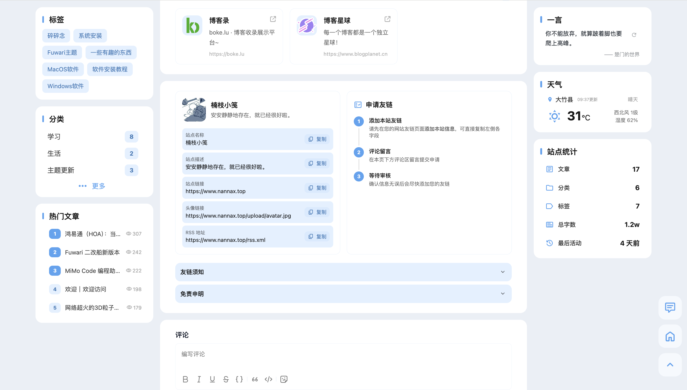
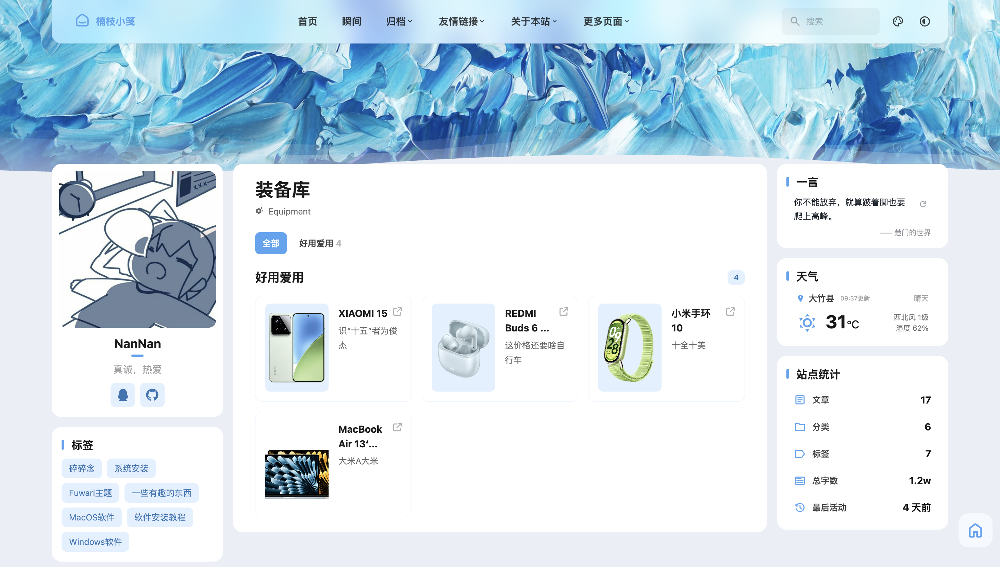
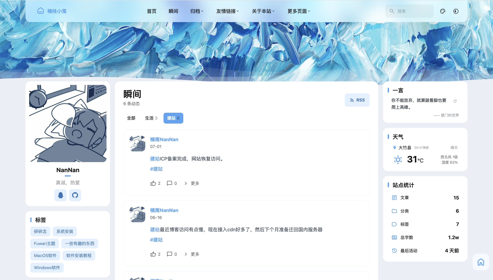

<h1 align="center">Halo-Theme-Ethereal</h1>

<p align="center">
  一款基于 <a href="https://github.com/jiewenhuang/halo-theme-fuwari">halo-theme-fuwari</a> 二次开发<br>
  为 <a href="https://github.com/halo-dev/halo">Halo 2.x</a> 打造的现代博客主题
</p>

<p align="center">
  <a href="https://halo.run">
    
  </a>
  <a href="https://github.com/AloneNanNan/halo-theme-ethereal/releases">
    
  </a>
  <a href="https://github.com/AloneNanNan/halo-theme-ethereal/blob/main/LICENSE">
    
  </a>
  <a href="https://github.com/AloneNanNan/halo-theme-ethereal/releases">
    
  </a>
</p>

<p align="center">
  
</p>

<div align="center">

|           🔗 友链           |           👥 朋友圈           |             💻 装备              |            📸 瞬间            |
| :-------------------------: | :---------------------------: | :------------------------------: | :---------------------------: |
|  |  |  |  |

</div>

<p align="center">
  预览：<a href="https://www.nannax.top">楠枝小笺</a>
</p>

---

## 介绍

**Ethereal** 是基于 [halo-theme-fuwari](https://github.com/jiewenhuang/halo-theme-fuwari)（原版 [Fuwari](https://github.com/saicaca/fuwari) 的 Halo 移植版）深度二次开发的博客主题。在保留原有清爽调性的基础上，新增了大量功能和视觉改进，感谢原作的开源贡献。

主题灵感来源于 [Firefly](https://github.com/CuteLeaf/Firefly) 的清新美学，融合了多种现代 UI 趋势，希望能为 Halo 用户提供一个好看且实用的主题选择。感谢 Firefly 的开源贡献。

主题使用AI辅助开发。

### 主题亮点

- **三栏/两栏布局随心切换** — 左侧栏 + 主内容区 + 右侧栏，充分利用宽屏空间，信息层级清晰
- **丰富的小组件** — 天气、音乐播放器、一言、站点统计、热门文章、自定义 HTML 等，左右侧边栏栏自由组合搭配
- **模糊混色效果** — 导航栏磨砂玻璃效果，通透有质感
- **Banner 居中大标题** — 支持自定义标题/副标题/字号，打字机/文字下坠两种动效，响应式字号缩放
- **卡片 3D 倾斜** — 部分卡片（如友情链接、朋友圈文章等卡片）随鼠标移动产生微妙的 3D 倾斜效果。
- **图片速度优化** — 支持主流 CDN/对象存储的实时图片压缩缩放，大幅降低封面图和正文图片加载体积
- **深色/浅色模式** — 支持跟随系统、手动切换，后台可配置默认配色

---

## 功能特性

### 核心功能

- [x] 三栏 / 两栏布局自由切换
- [x] 卡片化设计，响应式布局
- [x] 深色 / 浅色 / 跟随系统配色
- [x] 自定义主题色（Hue 调节）
- [x] i18n 国际化（中/英）
- [x] 页面过渡动画（Swup）
- [x] 丰富的小组件
- [x] 外链跳转模态框（自定义延迟、域名白名单）
- [x] 图片速度优化（支持阿里云 ESA/OSS、腾讯云 EdgeOne/COS、七牛云、又拍云等主流 CDN 实时压缩）

### 视觉效果

- [x] 导航栏磨砂玻璃模糊效果
- [x] Banner 波浪动效
- [x] 卡片 3D 鼠标悬停倾斜效果
- [x] 登录认证界面适配

### 侧边栏组件

| 组件        | 说明                                |
| :---------- | ----------------------------------- |
| 天气        | 基于腾讯位置服务，自动定位显示天气  |
| 音乐播放器  | 支持网易云、QQ、酷狗等平台歌单/歌曲 |
| 一言        | 随机显示一句名言或短句              |
| 站点统计    | 文章数、标签数、运行天数等          |
| 文章分类    | 分类列表导航                        |
| 文章标签    | 标签云导航                          |
| 热门文章    | 热度排行                            |
| 自定义 HTML | 自由嵌入任意内容                    |

### 页面支持

- [x] 首页
- [x] 文章归档
- [x] 标签列表 & 标签详情
- [x] 分类列表 & 分类详情
- [x] 图库展示（插件）
- [x] 瞬间 / 说说（插件）
- [x] 友情链接（插件）
- [x] 朋友圈（插件）
- [x] 装备展示（插件）
- [x] 自定义页面

---

## 插件支持

Ethereal 与以下 Halo 插件深度集成，建议搭配使用以获得完整体验：

| 插件         | 市场链接                                                 | 功能                  |
| :----------- | -------------------------------------------------------- | --------------------- |
| 搜索插件     | [应用市场](https://www.halo.run/store/apps/app-DlacW)    | 文章全文搜索          |
| 评论插件     | [应用市场](https://www.halo.run/store/apps/app-YXyaD)    | 文章评论系统          |
| 瞬间插件     | [应用市场](https://www.halo.run/store/apps/app-SnwWD)    | 瞬间/说说功能         |
| 图库插件     | [应用市场](https://www.halo.run/store/apps/app-BmQJW)    | 图库展示              |
| 链接管理插件 | [应用市场](https://www.halo.run/store/apps/app-hfbQg)    | 友情链接管理 & 朋友圈 |
| 自助提交友链 | [应用市场](https://www.halo.run/store/apps/app-glejqzwk) | 访客自助提交友链      |
| 装备管理     | [应用市场](https://www.halo.run/store/apps/app-ytygyqml) | 装备展示              |

---

## 外部服务依赖

本主题以下功能依赖外部第三方服务，请在使用前了解：

| 功能       | 外部服务                                         | 说明                                                                                                                         |
| :--------- | ------------------------------------------------ | ---------------------------------------------------------------------------------------------------------------------------- |
| 天气小组件 | [腾讯位置服务](https://lbs.qq.com)               | 需用户自行申请 WebService API Key（[免费注册](https://lbs.qq.com/dev/console/application/mine)），用于 IP 定位和天气数据查询 |
| 音乐播放器 | [Meting](https://github.com/metowolf/Meting-API) | 默认使用 Meting 公共 API 获取网易云/QQ/酷狗等平台的歌单歌曲数据，支持在设置中替换为自建 API                                  |
| 一言小组件 | [一言开发者中心](https://developer.hitokoto.cn)  | 随机获取一句名言短句，无需 API Key，支持 5 秒超时和本地 fallback                                                             |

> 以上服务均为可选功能，不影响主题核心的博客浏览体验。天气、音乐、一言小组件需在侧边栏设置中手动添加后才会发起网络请求。

---

## 安装

### 系统要求

- **Halo** >= 2.25.0

### 手动安装

1. 前往 [Releases](https://github.com/AloneNanNan/halo-theme-ethereal/releases) 下载最新版本的主题包（`.zip`）
2. 进入 Halo 后台 → **主题** → **安装**，上传主题包
3. 启用主题并进入 **设置** 进行个性化配置

### 在线安装（即将支持）

> Halo 应用商店搜索 "Ethereal" 即可一键安装（待上架）

---

## 项目结构

<details>
<summary>展开查看完整目录结构</summary>

```
halo-theme-ethereal/
├── i18n/                        # 国际化翻译文件
│   ├── default.properties       # 默认语言（英文）
│   ├── zh_CN.properties         # 简体中文
│   └── zh_TW.properties         # 繁体中文
├── public/                      # 静态资源
│   ├── assets/                  # JS 脚本、图片等
│   ├── fragments/               # Halo 页面片段
│   ├── gateway_fragments/       # 网关认证片段
│   └── themes/                  # 主题静态资源（图片、CSS 等）
├── screenshot/                  # 主题截图
├── src/
│   ├── components/              # 组件
│   │   ├── *.astro              # Astro 静态组件（Footer、Navbar、PostCard 等）
│   │   ├── *.svelte             # Svelte 交互组件（Search、LightDarkSwitch 等）
│   │   ├── control/             # 控件组件（分页、返回顶部、按钮等）
│   │   ├── misc/                # 杂项组件
│   │   ├── photos/              # 照片相关组件
│   │   └── widget/              # 侧边栏小部件（天气、音乐、目录、统计等）
│   ├── config.ts                # 主题配置（运行时）
│   ├── constants/               # 常量定义
│   ├── env.d.ts                 # 环境类型声明
│   ├── global.d.ts              # 全局类型声明
│   ├── layouts/                 # 页面布局
│   │   ├── Layout.astro         # 根布局
│   │   └── MainGridLayout.astro # 主网格布局
│   ├── pages/                   # 页面模板
│   │   ├── index.astro          # 首页
│   │   ├── post.astro           # 文章页
│   │   ├── archives.astro       # 归档页
│   │   ├── tags.astro           # 标签列表
│   │   ├── tag.astro            # 标签详情
│   │   ├── categories.astro     # 分类列表
│   │   ├── category.astro       # 分类详情
│   │   ├── photos.astro         # 图库列表
│   │   ├── photo.astro          # 图库详情
│   │   ├── moment.astro         # 瞬间详情
│   │   ├── moments.astro        # 瞬间列表
│   │   ├── links.astro          # 友情链接
│   │   ├── friends.astro        # 朋友圈
│   │   ├── equipments.astro     # 装备展示
│   │   └── page.astro           # 自定义页面
│   ├── scripts/                 # 应用入口脚本
│   │   └── app.ts               # 初始化逻辑（主题、滚动条、灯箱等）
│   ├── styles/                  # 全局样式
│   ├── types/                   # TypeScript 类型定义
│   └── utils/                   # 工具函数
├── astro.config.mjs             # Astro 构建配置
├── nodemon.json                 # 开发热更新配置
├── settings.yaml                # Halo 主题设置定义
├── svelte.config.js             # Svelte 配置
├── theme.yaml                   # Halo 主题元信息
├── tsconfig.json                # TypeScript 配置
├── pnpm-workspace.yaml          # pnpm 工作区配置
└── package.json                 # 项目依赖与脚本
```

</details>

---

## 开发

> 需要 **Node.js >= 22.12.0** 和 **pnpm**

```bash
# 克隆项目
git clone https://github.com/AloneNanNan/halo-theme-ethereal.git
cd halo-theme-ethereal

# 安装依赖
pnpm install

# 开发模式（监听文件变更自动重建）
pnpm dev

# 构建主题
pnpm build

# 构建并打包为主题安装包
pnpm build:pkg

# 代码格式化
pnpm format
```

### 技术栈

| 技术                                         | 用途                                |
| :------------------------------------------- | ----------------------------------- |
| [Astro](https://astro.build)                 | 静态页面生成与路由                  |
| [Svelte 5](https://svelte.dev)               | 交互组件（Search、LightDarkSwitch） |
| [Tailwind CSS 4](https://tailwindcss.com)    | 实用优先的样式框架                  |
| [TypeScript](https://www.typescriptlang.org) | 类型安全                            |
| [Swup](https://swup.js.org)                  | 页面过渡动画                        |
| [Iconify](https://iconify.design)            | 图标系统                            |

---

## 致谢

- [Halo](https://halo.run) — 优秀的 Java 博客系统
- [Fuwari](https://github.com/saicaca/fuwari) — 原始 Astro 主题，MIT 许可
- [halo-theme-fuwari](https://github.com/jiewenhuang/halo-theme-fuwari) — 原版 Halo 移植主题，MIT 许可
- [Firefly](https://github.com/CuteLeaf/Firefly) — 清新美观的 Astro 静态博客主题模板
- [Halo Sig](https://github.com/halo-sigs) — Halo 社区插件与工具链

---

## 许可证

[MIT License](./LICENSE) © 2026 楠南NanNan

本主题基于 [halo-theme-fuwari](https://github.com/jiewenhuang/halo-theme-fuwari)（MIT 许可）二次开发，遵守原始许可证条款。
